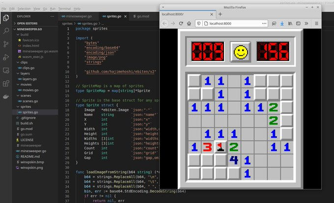

# ebiten-mines

This is written using ebiten v2 in Go:

    sudo apt install golang

To run the code you can execute:

    go run .

To run the code in your browser (using WASM) you can execute:

    bash build.sh

On Debian/Ubuntu I had to install the following packages:

    sudo apt install libc6-dev libglu1-mesa-dev libgl1-mesa-dev libxcursor-dev libxi-dev libxinerama-dev libxrandr-dev libxxf86vm-dev libasound2-dev pkg-config

See also: https://ebiten.org/documents/install.html

    
### Brotli

Install `brotli` command line compression tool using:

    sudo apt install brotli

Compress the WASM file using (takes several seconds):

    brotli -f -Z --suffix=-compressed *.wasm

Add the following `.htaccess` file on the webserver:

    <FilesMatch "\.wasm$">
        RewriteEngine On
        RewriteCond %{HTTP:Accept-Encoding} br
        RewriteCond %{REQUEST_FILENAME}-compressed -f
        RewriteRule (.*) $1-compressed
    </FilesMatch>
    
    <FilesMatch "\.wasm-compressed$">
        Header set Content-Encoding br
        Header set Content-Type application/wasm
        Header append Vary Accept-Encoding
    </FilesMatch>

Make sure that `mod_headers` and `mod_rewrite` are enabled.

    sudo a2enmod rewrite headers

Restart the apache webserver if the modules were activated using:

    sudo systemctl restart apache2

NB: Most webservers have the modules enabled by default.