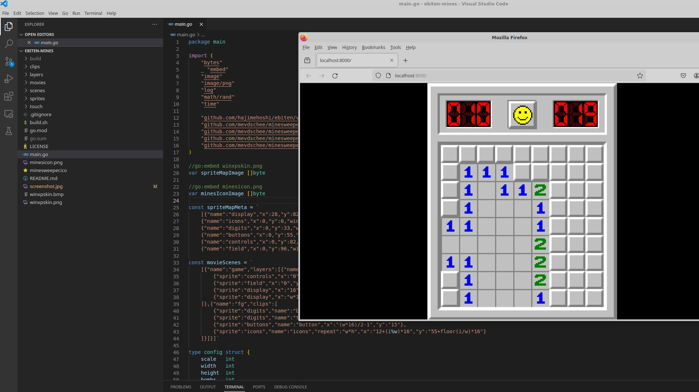

# minesweeper.go

This is written using ebiten v2 in Go:

    sudo apt install golang

To build/run the code you can execute:

    go run minesweeper.go

To build/run the code in your browser (using WASM) you can execute:

    bash build.sh

On Debian/Ubuntu I had to install the following packages:

    sudo apt install libc6-dev libglu1-mesa-dev libgl1-mesa-dev libxcursor-dev libxi-dev libxinerama-dev libxrandr-dev libxxf86vm-dev libasound2-dev pkg-config

See also: https://ebiten.org/documents/install.html

    
